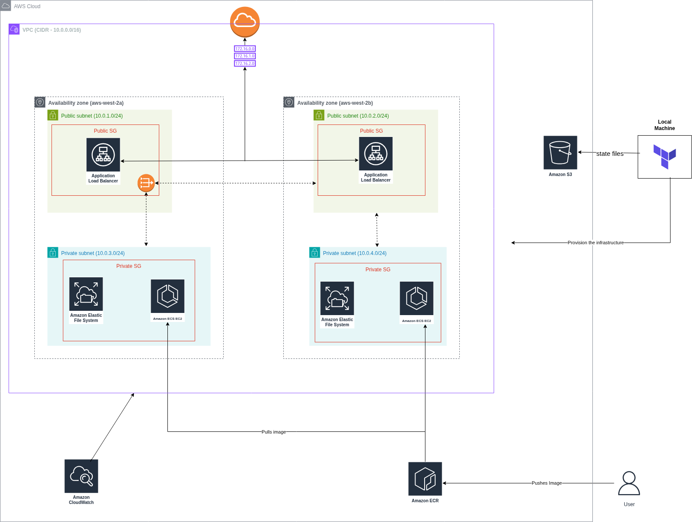

# ECS EC2 Nginx Deployment with ALB and EFS (Terraform)

This project automates the deployment of a highly available Nginx server using the AWS ECS EC2 launch type. It leverages Terraform to provision a secure, scalable infrastructure including an Application Load Balancer (ALB), Auto Scaling Group (ASG), and Elastic File System (EFS) for persistent storage.

## Prerequisites

Before running this project, ensure you have the following:

* **AWS Account:** An IAM user with programmatic access (AdministratorAccess or specific permissions for ECS, EC2, VPC, IAM, etc.).
* **Terraform CLI:** Installed locally (v1.5+ recommended).
* **AWS CLI:** Installed and configured locally with credentials.
* **S3 Backend:** An S3 bucket already created to store the Terraform state.
* **Docker Image:** A custom Nginx Docker image pushed to Amazon ECR.
* **EC2 Key Pair:** (Optional) An existing key pair if SSH access to instances is required.

## Architecture Diagram

## Project Directory Structure
├── backend.tf
├── main.tf
├── modules
│   ├── alb
│   │   ├── main.tf
│   │   ├── outputs.tf
│   │   └── variables.tf
│   ├── ecr
│   │   ├── main.tf
│   │   ├── outputs.tf
│   │   └── variables.tf
│   ├── ecs
│   │   ├── main.tf
│   │   ├── outputs.tf
│   │   ├── userdata.tpl
│   │   └── variables.tf
│   ├── efs
│   │   ├── main.tf
│   │   ├── outputs.tf
│   │   └── variables.tf
│   ├── security
│   │   ├── main.tf
│   │   ├── outputs.tf
│   │   └── variables.tf
│   └── vpc
│       ├── main.tf
│       ├── outputs.tf
│       └── variables.tf
├── outputs.tf
├── provider.tf
├── terraform.tfvars
└── variables.tf

## What This Project Does
This Terraform configuration deploys a fault-tolerant Nginx environment. The following resources are created:
    • **Networking:** A VPC with public and private subnets spanning two Availability Zones, including Internet Gateway, NAT Gateway, route tables, and security groups.
    • **Load Balancing:** An Application Load Balancer (ALB) placed in public subnets to distribute traffic.
    • **Compute:** An Auto Scaling Group that provisions ECS-optimized EC2 instances in private subnets.
    • **Orchestration:** An ECS Cluster and ECS Service to manage Nginx containers running on EC2.
    • **Storage:** EFS (Elastic File System) for persistent storage, mounted directly inside ECS containers.
    • **Registry:** ECR integration for pulling the custom Nginx Docker image.
    • **Security & Logs:**
        ◦ IAM roles and policies for EC2, ECS, ECR, EFS, and CloudWatch.
        ◦ CloudWatch log groups for capturing ECS task logs.

## How to Apply This Project

**Initialize Terraform**
terraform init

**Validate the configuration**
terraform validate

**Preview changes**
terraform plan

**Deploy the infrastructure**
terraform apply -auto-approve

**Post-deployment checks**
• Navigate to the AWS console
• Go to the ALB service
• Copy the ALB DNS name and access it in the browser
• You should see the Nginx page served from ECS EC2 using EFS as persistent storage

## Cleanup
To delete the entire infrastructure:
terraform destroy -auto-approve

Note: The S3 bucket used for Terraform state is not deleted by Terraform. You must remove it manually if you want to clean up everything.
